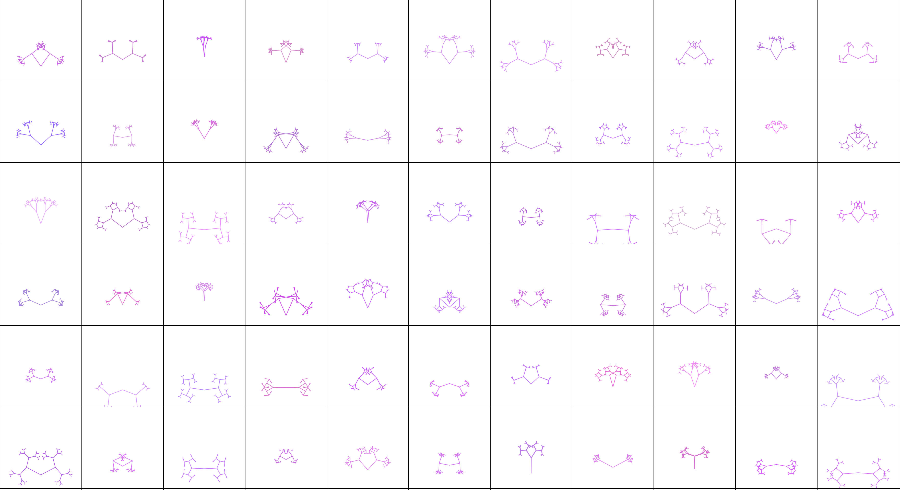

# the_blind_watchmaker
Blind watch maker app concept by Rickard dawkins using p5js

What all of this means:

  the screen displays the sample space for each generation. Each cell is a living organism. Clicking on a cell means only that organism gets to the next generation. The next generation will have similar organisms with slight variations in their characteristics. If you desire a specific characteristic(color, orientation of any two arms, or the angle between branches) keep on selecting organisms that have that particular feature in subsequent generations. at one point the generations will smoothen out with only those with your desired characteristic. This best works if only one feature(characteristic) is chosen or preferred at a time.

The Blind Watchmaker:

  You are the selector, and decide which organism gets to see the next generation. random factors change the organism a little bit every generation, such that only those with features that please you as the selector survive subsequent generations evolve those features that help them survive.

  Change the rate of mutations by altering the mutation rate value in watch.js file

still in build phase, feel free to direct it in whichever you want
